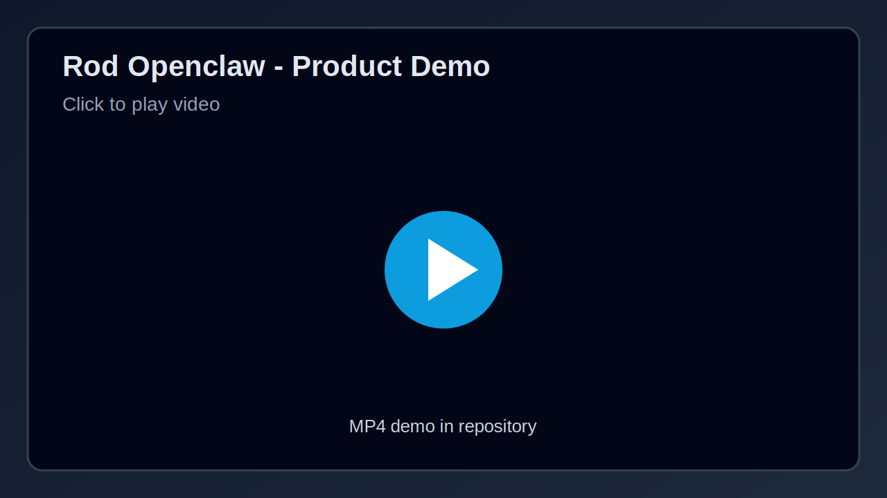

# EffectOS - Machine-Enforced Governance (MEG)

Deterministic governance for computational effects.
Runtime can propose, but only MEG can authorize and execute.

## What is EffectOS?

EffectOS is a governance-first compute model for high-assurance systems.
It removes execution authority from mutable runtime environments and applies deterministic policy checks before any state-changing operation.

This approach improves safety, auditability, and operational control for AI agents and critical automation.

## Project Purpose

Modern systems often trust runtime with both decision-making and execution.
EffectOS separates those concerns:

- Runtime handles reasoning and intent generation
- MEG validates intent against explicit policy
- MEG authorizes or denies effects deterministically
- Only authorized effects can materialize in the machine world

## MEG Agent SDK Flow Diagram

## Product Demo Video

- GitHub README usually does not allow true inline MP4 playback.
- Click the preview image to open and play the video.
- Direct file link: [rod-openclaw.mp4](https://raw.githubusercontent.com/Fahad7452/rod_openclaw/main/assets/rod-openclaw.mp4)

## Key Use Cases

- AI agent tool execution with strict effect controls
- Infrastructure automation with policy gates
- Compliance-heavy workflows with deterministic approvals
- Financial and operational actions requiring audit-first execution

Full details: `docs/use-cases.md`

## Product Capabilities

- Deterministic effect authorization before state changes
- Explicit policy envelopes for high-risk operations
- Deny-by-default governance posture
- Centralized decisioning for multi-agent environments
- Audit-first operation model for compliance evidence
- SDK-oriented integration for runtime and service ecosystems

## Trust and Execution Model

EffectOS separates reasoning from authority:

- Runtime can propose intents and effect candidates
- MEG validates each effect against explicit policy
- Only positively authorized effects are executed
- Denied effects are blocked and retained for audit visibility

This creates enforceable governance boundaries that remain stable even if runtime behavior changes.

## Security Policy

### Supported Scope

Security reports are accepted for active project materials in this repository, excluding archival material.

### Reporting a Vulnerability

Include the following in your report:

- Vulnerability type and impact category
- Affected component or document path
- Reproduction steps and expected behavior
- Actual behavior and potential blast radius

### Response Expectations

Reports are prioritized based on:

- Exploitability
- Impact on authorization and execution boundaries
- Impact on audit integrity and traceability

### Security Controls (Design Level)

- No direct runtime execution authority for high-impact effects
- Positive authorization required before execution
- Deny-by-default fallback for uncertain outcomes
- Deterministic decision outputs with explainable reason codes
- Protected audit trail model for post-incident review

Full reference: `SECURITY.md` and `docs/threat-model.md`

## Threat and Risk Focus

EffectOS is designed to reduce critical governance failures such as:

- Runtime compromise attempting unauthorized effect execution
- Policy tampering that broadens unsafe allow conditions
- Audit-trail manipulation that hides execution history
- Replay of previously valid effect requests
- Integration gaps that bypass MEG authorization paths

## Policy Authoring Principles

For production-safe policy design:

- Default to deny and add narrow allow rules
- Use explicit target and context constraints
- Keep policy deterministic and testable
- Separate authorization from effect materialization
- Emit audit-friendly reason codes for allow and deny decisions

Reference guide: `docs/policy-authoring-guide.md`

## Getting Started Path

1. Read project purpose and boundary model in `docs/purpose.md`
2. Review integration requirements in `docs/integration-checklist.md`
3. Author or adapt policy using `docs/policy-authoring-guide.md`
4. Validate operational readiness with `docs/release-checklist.md`
5. Align testing with `docs/testing-strategy.md`

## Operations and Compliance Readiness

- `docs/operations-runbook.md` defines incident and runtime procedures
- `docs/incident-response.md` covers security and recovery handling
- `docs/versioning-and-releases.md` captures release governance discipline
- `docs/adr/README.md` tracks architecture decision records

## Product Positioning

EffectOS is a governance-first execution control layer for teams that need deterministic, auditable, and policy-driven control over computational effects in AI and automation systems.

## Documentation

- `docs/index.md` - Full documentation map
- `docs/purpose.md` - Mission, scope, and non-goals
- `docs/getting-started.md` - Quick onboarding steps
- `docs/policy-authoring-guide.md` - How to write safe deterministic policy
- `docs/threat-model.md` - Security risk model and controls
- `docs/operations-runbook.md` - Incident and operations procedures
- `docs/release-checklist.md` - Pre-release governance checklist
- `docs/integration-checklist.md` - Service/agent integration checklist
- `docs/testing-strategy.md` - What to test and why
- `docs/incident-response.md` - Incident handling playbook
- `docs/versioning-and-releases.md` - Versioning and release process
- `docs/adr/README.md` - Architecture decisions index

## Repository Standards

- [ARCHITECTURE.md](./ARCHITECTURE.md) - MEG boundaries and system invariants
- [TESTING.md](./TESTING.md) - Required testing and release gate conditions
- [VERSIONING.md](./VERSIONING.md) - Versioning and release semantics
- [SECURITY.md](./SECURITY.md) - Security and vulnerability reporting guidance
- [SUPPORT.md](./SUPPORT.md) - Support and communication channels
- [CODE_OF_CONDUCT.md](./CODE_OF_CONDUCT.md) - Community behavior expectations
- [MAINTAINERS.md](./MAINTAINERS.md) - Maintainer roles and ownership
- [CONTRIBUTING.md](./CONTRIBUTING.md) - Contribution workflow and quality rules
- [CHANGELOG.md](./CHANGELOG.md) - Project change history

## Guiding Principle

If an effect is not authorized, it does not execute.
