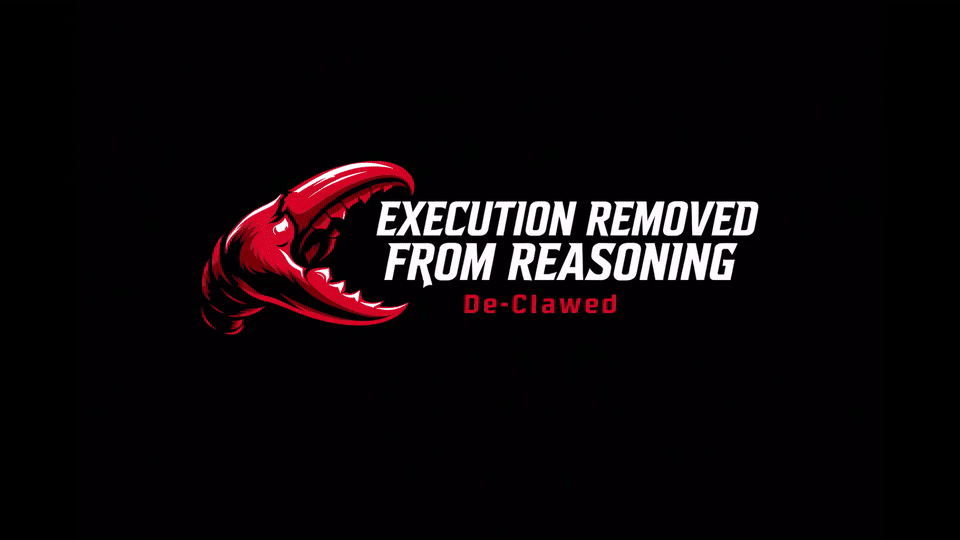

<h1 align="center">EffectOS — Machine-Enforced Governance (MEG)</h1>

<p align="center">
  <strong>Execution authority does not exist in runtime.</strong><br/>
  Runtime can reason. Runtime can request. Runtime cannot execute.
</p>

<p align="center">
  
  
  
  
  
</p>

---

> **EffectOS and Machine-Enforced Governance (MEG) are patent-pending architectures defining a new model for governed compute.**

---

## What is EffectOS?

EffectOS is a **governance-first compute primitive** for high-assurance systems that removes execution authority from mutable runtime environments and applies **deterministic, cryptographically-validated policy checks** before any state-changing operation can occur.

Traditional systems trust runtime with both decision-making and execution. EffectOS separates those concerns permanently:

| Traditional Systems | EffectOS |
|---|---|
| Runtime decides what is allowed | Execution authority is externalized |
| Policies are mutable | Only positively authorized effects execute |
| Execution authority is inherited | Authorization is cryptographically validated |
| No audit guarantee | Deny-by-default with full audit trail |

---

## Why This Matters

Modern systems are built on a critical assumption: **execution authority resides within the runtime**. This creates inherent risks:

- Mutable runtime environments can be altered or compromised
- Execution authority is implicitly granted, not explicitly controlled
- Systems can produce unintended or unsafe state changes

EffectOS challenges this model by:
- Removing execution authority from the runtime entirely
- Requiring explicit authorization for all effects
- Ensuring unauthorized actions are never executed

**No execution without authorization.**

### The EffectOS Paradigm Shift

EffectOS introduces Machine-Enforced Governance (MEG) — a fundamental shift in how computation interacts with state:

**Traditional Systems Assume:**
- Execution inherently carries authority
- Code running in a runtime can directly cause side effects

**EffectOS Rejects This:**
- Computation is decoupled from execution authority
- Systems may reason, plan, and propose actions
- But state changes only occur when explicitly authorized

### Core Principles

**Separation of Concerns**
Logic and authority are independent layers. Execution ≠ Permission.

**Deterministic Effects**
Every state change is explicitly approved. No implicit or hidden side effects.

**Explicit Authorization**
Effects require governance approval before execution. Unauthorized actions are safely ignored.

**Minimal Trust Runtime**
Runtime environments cannot mutate state by default. Authority is externally controlled.

---

## Core Architecture — Two-Plane Model

EffectOS separates the system into two distinct operational planes with strict separation of concerns:

### Runtime Plane
Responsible for computation **without authority**:
- Reasoning over inputs
- Planning potential actions
- Proposing effects

**Constraints:** No ability to authorize actions, no execution privileges. Outputs remain advisory until validated.

### MEG Plane (Machine-Enforced Governance)
Responsible for control and enforcement:
- Deterministic validation of proposed actions
- Authorization based on predefined governance rules
- Execution of approved effects only

**Execution Semantics:**
1. Runtime proposes an effect
2. MEG validates, authorizes, and executes
3. Only positively authorized effects materialize

### Architecture Invariants

1. **No effect executes without explicit authorization** — Every state change requires MEG approval
2. **Unknown effects are denied by default** — Deny-by-default fallback for uncertain outcomes
3. **Authorization decisions are deterministic and explainable** — Reason codes for all decisions
4. **Every decision is recorded in the audit trail** — Full traceability for compliance and incident response

### Trust Boundaries

- **Runtime** is treated as mutable and potentially compromised
- **MEG** is the execution authority boundary
- **Policy** is the machine-enforced contract between intent and execution

### Design Consequences

- Policy quality directly affects safety
- Integration paths must prevent MEG bypass
- Operational runbooks are required for incident response and rollback

---

## How It Works — Two-Gate Execution Model

```
┌─────────────────────────────────────────────────────┐
│              NON-AUTHORITATIVE RUNTIME               │
│         No Execution Authority · Proposals Only      │
│              Agent / API / CLI / User                │
└──────────────────────┬──────────────────────────────┘
                       │  Effect Proposal (P/A/G/E Envelope)
                       ▼
┌─────────────────────────────────────────────────────┐
│           GATE 1 — MEG GOVERNANCE LAYER              │
│  • Canonicalize effect                               │
│  • Validate via CHVE (Cryptographic Hash Validation) │
│  • Validate via THVE (Temporal Hash Validation)      │
│  • Write authorization proof to CAT                  │
└──────────────────────┬──────────────────────────────┘
                       │  CAT Proof
                       ▼
┌─────────────────────────────────────────────────────┐
│           GATE 2 — EXTERNAL EXECUTION                │
│  • Verify CAT proof                                  │
│  • Execute ONLY if authorized                        │
│  • No proof → No execution. Full stop.               │
└─────────────────────────────────────────────────────┘
```

**No proof → No execution.**

---

## Core Concepts

### Computational Effects
A computational effect is any operation that modifies system state. Examples include:
- Writing to a file system
- Executing a system command
- Calling an external API
- Transferring value between accounts

**Key principle:** Reality (system state) changes only when a computational effect is successfully executed and materialized.

### Machine-Enforced Governance (MEG)
MEG is a governance model for controlling computational effects through deterministic, externally validated rules. Core properties:
- **Positive authorization only** — Actions must be explicitly permitted before execution
- **No execution authority in runtime** — Runtime does not independently grant or assume permission
- **Canonical Audit Trail (CAT) required** — All decisions are recorded in an immutable, traceable structure

### Core Primitives

**Canonical Effects**
Effects are strictly matched — no fuzzy authorization, no ambiguity. Every effect must be canonicalized before evaluation by MEG.

**P/A/G/E Envelope Structure**
Every effect proposal is wrapped in a structured envelope:
- **P** — Proposal
- **A** — Authorization context
- **G** — Governance metadata
- **E** — Effect payload

**Integrity Model — CHVE / THVE**
- **CHVE** (Cryptographic Hash Validation Engine) — ensures effect integrity hasn't been tampered with
- **THVE** (Temporal Hash Validation Engine) — ensures authorization is valid within its time window

**CAT — Cryptographic Authorization Token**
The proof artifact written by MEG after successful validation. External execution verifies the CAT before any action is taken.

---

## Agent SDK

The Agent SDK is a deterministic enforcement layer for governing AI agent execution of computational effects.

### Purpose
Agents operate inside the MEG boundary. They can reason and propose effects, but **cannot execute without a valid CAT authorization**. The Agent SDK handles:
- Envelope construction
- CAT verification
- Execution gating

### Example Usage

```python
from effectos import MEGGuard

guard = MEGGuard(policy="domain.json")

guard.execute("file.write", path="/etc/passwd")
# → denied
```

### How It Works
1. Agent proposes an effect (e.g., file write, API call, command execution)
2. SDK wraps the effect in a P/A/G/E envelope
3. Effect is sent to MEG for validation and authorization
4. MEG returns a CAT (Cryptographic Authorization Token) if approved
5. SDK verifies CAT before executing the effect
6. If no CAT or invalid CAT → execution is blocked

### Key Features
- **Deterministic enforcement** — Same effect always produces same authorization decision
- **No implicit execution** — Effects require explicit approval
- **Audit-ready** — Every decision is traceable
- **Policy-driven** — Authorization based on explicit governance rules

---

## High-Risk Effect Categories

EffectOS applies stricter constraints, review paths, and audit visibility to:
- `command.exec` — System command execution
- `file.write` — File system writes
- `api.mutate` — External API mutations
- `value.transfer` — Financial or value transfers

---

## Key Use Cases

- **AI Agent Execution** — Strict effect controls prevent agents from taking unauthorized actions
- **Infrastructure Automation** — Policy gates on every infrastructure change
- **Compliance Workflows** — Deterministic approvals with full audit evidence
- **Financial Operations** — Audit-first execution for high-risk transactions
- **Operational Technology (OT)** — Physical actions require explicit MEG authorization

---

## Demo

### Flow Diagram


### Product Demo


---

## Trust and Execution Model

EffectOS creates enforceable governance boundaries that remain stable even if runtime behavior changes:

- Runtime **proposes** intents and effect candidates
- MEG **validates** each effect against explicit policy
- MEG **authorizes or denies** effects deterministically
- Only **positively authorized** effects are executed
- Denied effects are **blocked and retained** for audit visibility

---

## Security Model

### Design-Level Controls
- No direct runtime execution authority for high-impact effects
- Positive authorization required before execution
- Deny-by-default fallback for uncertain outcomes
- Deterministic decision outputs with explainable reason codes
- Protected audit trail model for post-incident review

### Threat Focus
EffectOS is designed to eliminate:
- Runtime compromise attempting unauthorized effect execution
- Policy tampering that broadens unsafe allow conditions
- Audit-trail manipulation hiding execution history
- Replay of previously valid effect requests
- Integration gaps that bypass MEG authorization paths

Full reference: [`SECURITY.md`](./SECURITY.md)

---

## Policy Authoring Principles

- Default to **deny** — add narrow allow rules only
- Use explicit target and context constraints
- Keep policy **deterministic and testable**
- Separate authorization from effect materialization
- Emit audit-friendly reason codes for allow and deny decisions

---

## Getting Started

1. **Understand the Model** — Read [`docs/purpose.md`](./docs/purpose.md) for project mission and scope
2. **Learn the Architecture** — Review [`ARCHITECTURE.md`](./ARCHITECTURE.md) for MEG boundaries and system invariants
3. **Integration Guide** — Follow [`docs/getting-started.md`](./docs/getting-started.md) for step-by-step onboarding
4. **Define Effects** — Identify effect categories your system must govern
5. **Write Policy** — Start with explicit allow rules and deny-by-default
6. **Integrate SDK** — Route runtime-proposed actions through MEG
7. **Test Scenarios** — Validate both allowed and disallowed effects
8. **Enable Audit** — Ensure every effect decision has a durable record

---

## Roadmap

EffectOS will evolve through the following key milestones:

### Phase 1: Agent SDK
- Enable systems to define and emit proposed effects
- Provide abstractions for reasoning and planning layers
- Standardize how agents interact with the MEG model
- **Deliverables:** SDK library, effect envelope specification, policy schema

### Phase 2: Endpoint SDK
- Define interfaces for controlled execution environments
- Enable endpoints to receive only authorized effects
- Ensure strict separation between execution and authority
- **Deliverables:** Endpoint integration library, CAT verification module

### Phase 3: Full MEG Infrastructure
- Implement the complete governance layer
- Support policy definition and enforcement
- Provide auditability and deterministic execution guarantees
- **Deliverables:** MEG engine, policy validator, audit trail system

### Phase 4: Future Direction
- Policy engines and rule systems
- Observability and audit logs
- Multi-agent governance coordination
- Integration with existing systems
- **Deliverables:** Advanced policy language, observability dashboards, multi-agent orchestration

---

## Documentation

| Document | Description |
|---|---|
| [`docs/index.md`](./docs/index.md) | Full documentation map |
| [`docs/purpose.md`](./docs/purpose.md) | Mission, scope, and non-goals |
| [`docs/getting-started.md`](./docs/getting-started.md) | Integration requirements and onboarding |
| [`docs/testing-strategy.md`](./docs/testing-strategy.md) | What to test and why |
| [`docs/versioning-and-releases.md`](./docs/versioning-and-releases.md) | Release governance |
| [`docs/adr/README.md`](./docs/adr/README.md) | Architecture decision records |
| [`ARCHITECTURE.md`](./ARCHITECTURE.md) | MEG boundaries and system invariants |
| [`SECURITY.md`](./SECURITY.md) | Security and vulnerability reporting |
| [`TESTING.md`](./TESTING.md) | Testing and release gate conditions |
| [`VERSIONING.md`](./VERSIONING.md) | Versioning semantics |

---

## Community

| | |
|---|---|
| [`CODE_OF_CONDUCT.md`](./CODE_OF_CONDUCT.md) | Community behavior expectations |
| [`MAINTAINERS.md`](./MAINTAINERS.md) | Maintainer roles and ownership |
| [`SUPPORT.md`](./SUPPORT.md) | Support and communication channels |

---

## FAQ

### Is this a sandbox?
No. MEG does not function as a sandbox environment. It removes execution authority entirely rather than isolating execution. Sandboxes restrict where code runs; EffectOS prevents unauthorized code from running at all.

### Is this RBAC (Role-Based Access Control)?
No. MEG is not based on roles or identity-based permissions. It governs system effects and execution capability, not user identities. RBAC controls who can do something; EffectOS controls what can be done, regardless of who requests it.

### What happens if an admin is compromised?
Compromise of an admin does not grant execution ability. Without explicit authorization, execution cannot occur. Therefore, no authorization still equals no execution. An attacker with admin credentials still cannot execute unauthorized effects.

### How does EffectOS differ from traditional security models?

| Aspect | Traditional Systems | EffectOS (MEG) |
|---|---|---|
| Execution Authority | Implicit in runtime | Externalized & explicit |
| Side Effects | Often implicit | Fully controlled |
| Security Model | Reactive (defensive) | Preventive (structural) |
| Trust Boundary | Runtime | Governance layer |
| Authorization | Identity-based | Effect-based |
| Default Behavior | Allow unless denied | Deny unless authorized |

### Can EffectOS prevent all attacks?
No. EffectOS prevents unauthorized effect execution, but it doesn't protect against:
- Compromised policy definitions
- Bugs in the MEG implementation
- Social engineering or policy abuse
- Effects that are explicitly authorized but misused

EffectOS is a structural control, not a complete security solution.

### What's the performance impact?
Every effect must pass through MEG validation before execution. This adds latency proportional to policy complexity. For high-frequency operations, batch validation and caching strategies can mitigate overhead.

### Can I use EffectOS with existing systems?
Yes, through the SDK layer. Existing systems can be integrated by:
1. Identifying state-changing operations (effects)
2. Wrapping them in P/A/G/E envelopes
3. Routing through MEG before execution
4. Verifying CAT before materializing effects

Integration complexity depends on system architecture.

---

<p align="center">
  <strong>If an effect is not authorized, it does not execute.</strong>
</p>
